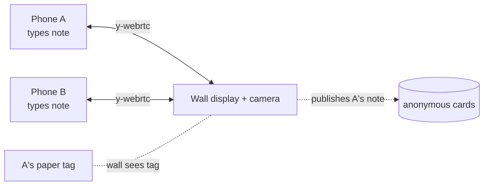

# mesh-retro

[](https://baditaflorin.github.io/mesh-retro/)
[](https://github.com/baditaflorin/mesh-retro/blob/main/package.json)
[](LICENSE)
[](docs/adr/0001-deployment-mode.md)

> Peer-to-peer mesh retro: anonymous Mad/Sad/Glad board with dot voting. ArUco mode for hands-free, in-person paper-sticky retros.

**Live:** https://baditaflorin.github.io/mesh-retro/

Run a retro from any combination of phones and one big screen. Cards are
anonymous — the data model literally has no author field on published cards
(see [ADR 0003](docs/adr/0003-anonymity-via-no-from-field.md)). Three
phases: **compose** (type and publish), **vote** (3 dots per person),
**action** (top 3 highlighted, export as markdown).

## Try it in 2 tabs

Open the [live app](https://baditaflorin.github.io/mesh-retro/) in two
browser tabs (same link = same room). In tab one, type a card and tap **Send
to wall** — it appears in tab two instantly. Switch to the **Vote** phase and
dot-vote; the tally syncs both ways. That's the whole mesh: no server, no
login, no install.

## How it works

1. Every phone joins a shared **Yjs document** over **y-webrtc** via my
   [self-hosted signaling server](https://github.com/baditaflorin/signaling-server).
2. **Compose phase** — type a card, pick a column, tap "Send to wall."
3. **Vote phase** — 3 dot votes per person, enforced by tracking
   `Y.Map<cardId, Y.Map<peerId, true>>`.
4. **Action phase** — top 3 cards by vote count get a highlight; "Export as
   markdown" downloads them as a checklist for your tracker of choice.

In **ArUco mode**, one phone is the wall display + camera. Each participant
writes their card on paper next to a printed ArUco tag, holds the paper up
to the wall's camera, and the typed note (which lived locally on their
phone) is published to the board. The tag is a **publish trigger**, not a
content carrier (see [ADR 0002](docs/adr/0002-apriltag-triggers-publish.md)).

## Privacy threat model

See [docs/privacy.md](docs/privacy.md). Cards carry no peer identity once
published; the pending-note map is local-state until publication.

## Print the tag sheet

`npm run make-markers` produces:

- `public/markers/marker-{0..19}.png`
- `public/marker-sheet.pdf` — A4 printable, 4×4 grid of IDs 0–15.

Open Settings in the live app, tap **Download printable marker sheet (PDF)**,
print at 100% scale, and hand a tag to each retro participant. They set
their tag ID in their own Settings.

## Architecture

- **Mode A** — pure GitHub Pages.
- **WebRTC** — Yjs + y-webrtc with self-hosted signaling and TURN.
- **ArUco** — `js-aruco2` + `ARUCO_MIP_36h12` dictionary.



## Run it locally

```bash
git clone https://github.com/baditaflorin/mesh-retro.git
cd mesh-retro
npm install
npm run make-markers
npm run dev
```

## Build for Pages

```bash
npm run build
npm run pages-preview
```

The `docs/` output is committed to the repo. GitHub Pages serves from
`main` branch, `/docs` folder.

## Self-hosted infrastructure

| Repo                                                                   | Endpoint                               | Role                        |
| ---------------------------------------------------------------------- | -------------------------------------- | --------------------------- |
| [signaling-server](https://github.com/baditaflorin/signaling-server)   | `wss://turn.0docker.com/ws`            | y-webrtc protocol fan-out   |
| [turn-token-server](https://github.com/baditaflorin/turn-token-server) | `https://turn.0docker.com/credentials` | HMAC TURN creds, 1-hour TTL |
| [coturn-hetzner](https://github.com/baditaflorin/coturn-hetzner)       | `turn:turn.0docker.com:3479`           | TURN relay                  |

Override from the in-app Settings drawer.

## Settings (in-app)

- **Room ID**
- **Your tag ID** (1–249)
- **Column set** — Mad/Sad/Glad or Start/Stop/Continue
- **Publish mode** — tap or ArUco
- **This phone is the wall display** — toggle for the device running the camera
- **Signaling / TURN URLs** — overrides

## ADRs

- [0001 — Deployment mode](docs/adr/0001-deployment-mode.md)
- [0002 — ArUco triggers publish, not encodes content](docs/adr/0002-apriltag-triggers-publish.md)
- [0003 — Anonymity via "no from-field"](docs/adr/0003-anonymity-via-no-from-field.md)
- [0010 — GitHub Pages publishing](docs/adr/0010-pages-publishing.md)

## Local hooks (no GitHub Actions)

```bash
git config core.hooksPath .githooks
```

## License

[MIT](LICENSE) © 2026 Florin Badita
